# ERD Sistem Ujian Online PMB Politeknik Aceh

Dokumen ini menjelaskan struktur database yang dibentuk oleh migrasi `001` sampai `017`. Skema aktif terdiri dari 22 tabel aplikasi dan satu tabel pencatatan migrasi. Alur pendaftaran publik dan pembayaran tidak termasuk dalam sistem ini.

Database menggunakan MySQL atau MariaDB, engine InnoDB, UUID teks `CHAR(36)` sebagai identitas utama, dan waktu database dalam UTC. Antarmuka menampilkan jadwal operasional dalam WIB.

## 1 Ringkasan domain

| Domain | Tabel |
|---|---|
| Akun dan peserta | `users`, `participants`, `consent_records`, `verification_decisions` |
| Konfigurasi | `study_programs`, `admission_waves` |
| Bank soal | `question_categories`, `questions` |
| Sesi dan penugasan | `exam_sessions`, `exam_assignments` |
| Pelaksanaan ujian | `exam_attempts`, `attempt_questions`, `exam_answers`, `exam_session_consents` |
| Hasil dan keputusan | `exam_results`, `official_decisions` |
| Pengawasan | `exam_security_events`, `proctoring_photos` |
| Retensi | `retention_holds`, `retention_default_policies`, `participant_retention_overrides` |
| Audit dan migrasi | `audit_logs`, `schema_migrations` |

## 2 Diagram hubungan entitas

```mermaid
erDiagram
    USERS ||--o| PARTICIPANTS : "akun peserta"
    USERS ||--o{ QUESTIONS : "membuat soal"
    USERS ||--o{ EXAM_SESSIONS : "membuat sesi"
    USERS ||--o{ EXAM_ASSIGNMENTS : "memberi penugasan"
    USERS ||--o{ VERIFICATION_DECISIONS : "memverifikasi"
    USERS ||--o{ OFFICIAL_DECISIONS : "mengelola keputusan"
    USERS ||--o{ RETENTION_HOLDS : "mengelola hold"
    USERS ||--o{ PARTICIPANT_RETENTION_OVERRIDES : "mengelola pengecualian"

    STUDY_PROGRAMS ||--o{ PARTICIPANTS : "dipilih peserta"
    ADMISSION_WAVES ||--o{ PARTICIPANTS : "diikuti peserta"
    ADMISSION_WAVES ||--o{ EXAM_SESSIONS : "memiliki sesi"

    PARTICIPANTS ||--o{ CONSENT_RECORDS : "memiliki persetujuan umum"
    PARTICIPANTS ||--o{ VERIFICATION_DECISIONS : "memiliki riwayat verifikasi"
    PARTICIPANTS ||--o{ EXAM_ASSIGNMENTS : "menerima penugasan"
    PARTICIPANTS ||--o{ EXAM_ATTEMPTS : "memiliki attempt"
    PARTICIPANTS ||--o{ EXAM_RESULTS : "memiliki hasil"
    PARTICIPANTS ||--o{ EXAM_SESSION_CONSENTS : "memberi persetujuan ujian"
    PARTICIPANTS ||--o{ EXAM_SECURITY_EVENTS : "menghasilkan kejadian"
    PARTICIPANTS ||--o{ PROCTORING_PHOTOS : "memiliki foto awal"
    PARTICIPANTS ||--o{ OFFICIAL_DECISIONS : "menerima keputusan"
    PARTICIPANTS ||--o{ RETENTION_HOLDS : "dikenai hold"
    PARTICIPANTS ||--o| PARTICIPANT_RETENTION_OVERRIDES : "memiliki pengecualian"

    QUESTION_CATEGORIES ||--o{ QUESTIONS : "mengelompokkan"
    QUESTIONS ||--o{ ATTEMPT_QUESTIONS : "menjadi sumber snapshot"

    EXAM_SESSIONS ||--o{ EXAM_ASSIGNMENTS : "memiliki penugasan"
    EXAM_SESSIONS ||--o{ EXAM_ATTEMPTS : "memiliki attempt"
    EXAM_SESSIONS ||--o{ EXAM_RESULTS : "menghasilkan nilai"
    EXAM_SESSIONS ||--o{ EXAM_SESSION_CONSENTS : "memiliki persetujuan"

    EXAM_ATTEMPTS ||--o{ ATTEMPT_QUESTIONS : "memuat snapshot soal"
    EXAM_ATTEMPTS ||--o{ EXAM_ANSWERS : "memuat jawaban"
    EXAM_ATTEMPTS ||--o| EXAM_RESULTS : "menghasilkan satu nilai"
    EXAM_ATTEMPTS ||--o{ EXAM_SECURITY_EVENTS : "mencatat kejadian"
    EXAM_ATTEMPTS ||--o| PROCTORING_PHOTOS : "memiliki satu foto awal"

    ATTEMPT_QUESTIONS ||--o| EXAM_ANSWERS : "memiliki jawaban"
    EXAM_RESULTS ||--o{ OFFICIAL_DECISIONS : "memiliki riwayat keputusan"
    OFFICIAL_DECISIONS o|--o{ OFFICIAL_DECISIONS : "menggantikan keputusan"

    USERS {
        char36 id PK
        varchar username UK
        varchar email UK
        varchar password_hash
        enum role
        enum status
        datetime created_at
        datetime updated_at
    }

    PARTICIPANTS {
        char36 id PK
        char36 user_id FK, UK
        varchar registration_number UK
        text password_ciphertext
        varchar full_name
        varchar email
        varchar phone_number
        varchar school_name
        smallint graduation_year
        char36 program_id FK
        char36 wave_id FK
        varchar program_choice
        varchar wave
        enum account_status
        enum verification_status
        datetime registration_submitted_at
        datetime created_at
        datetime updated_at
    }

    CONSENT_RECORDS {
        char36 id PK
        char36 participant_id FK
        varchar consent_version
        varchar consent_type
        datetime accepted_at
        datetime created_at
    }

    VERIFICATION_DECISIONS {
        char36 id PK
        char36 participant_id FK
        enum decision
        json checklist_json
        text note
        char36 reviewed_by FK
        datetime created_at
    }

    STUDY_PROGRAMS {
        char36 id PK
        varchar code UK
        varchar name UK
        boolean is_active
        datetime created_at
        datetime updated_at
    }

    ADMISSION_WAVES {
        char36 id PK
        varchar code UK
        varchar name UK
        boolean is_active
        smallint exam_question_count
        smallint exam_duration_minutes
        decimal passing_grade
        enum security_mode
        datetime registration_opens_at
        datetime registration_closes_at
        datetime created_at
        datetime updated_at
    }

    QUESTION_CATEGORIES {
        char36 id PK
        varchar code UK
        varchar name UK
        boolean is_active
        datetime created_at
        datetime updated_at
    }

    QUESTIONS {
        char36 id PK
        char36 category_id FK
        text question_text
        text option_a
        text option_b
        text option_c
        text option_d
        enum correct_option
        boolean is_active
        char36 created_by FK
        datetime created_at
        datetime updated_at
    }

    EXAM_SESSIONS {
        char36 id PK
        char36 wave_id FK
        varchar name
        enum status
        datetime starts_at
        datetime ends_at
        varchar token_hash
        text token_ciphertext
        varchar token_hint
        smallint question_count
        smallint duration_minutes
        decimal passing_grade
        enum security_mode
        char36 created_by FK
        datetime created_at
        datetime updated_at
    }

    EXAM_ASSIGNMENTS {
        char36 id PK
        char36 session_id FK
        char36 participant_id FK
        enum assignment_status
        char36 assigned_by FK
        datetime assigned_at
        datetime created_at
        datetime updated_at
    }

    EXAM_ATTEMPTS {
        char36 id PK
        char36 session_id FK
        char36 participant_id FK
        smallint attempt_no
        enum status
        datetime started_at
        datetime expires_at
        datetime submitted_at
        datetime created_at
        datetime updated_at
    }

    ATTEMPT_QUESTIONS {
        char36 id PK
        char36 attempt_id FK
        char36 question_id FK
        smallint position
        text question_text
        json options_json
        json option_order
        enum correct_option
        datetime created_at
    }

    EXAM_ANSWERS {
        char36 id PK
        char36 attempt_id FK
        char36 attempt_question_id FK
        enum selected_option
        datetime saved_at
        datetime created_at
        datetime updated_at
    }

    EXAM_RESULTS {
        char36 id PK
        char36 attempt_id FK, UK
        char36 participant_id FK
        char36 session_id FK
        decimal score
        smallint correct_count
        smallint incorrect_count
        smallint unanswered_count
        enum status
        boolean is_visible
        datetime scored_at
        datetime created_at
    }

    EXAM_SESSION_CONSENTS {
        char36 id PK
        char36 participant_id FK
        char36 session_id FK
        varchar consent_version
        datetime accepted_at
        datetime created_at
    }

    EXAM_SECURITY_EVENTS {
        char36 id PK
        char36 attempt_id FK
        char36 participant_id FK
        enum event_type
        json details_json
        datetime created_at
    }

    PROCTORING_PHOTOS {
        char36 id PK
        char36 attempt_id FK, UK
        char36 participant_id FK
        varchar storage_key UK
        varchar mime_type
        bigint size_bytes
        varchar content_hash
        datetime captured_at
        datetime created_at
    }

    OFFICIAL_DECISIONS {
        char36 id PK
        char36 result_id FK
        char36 participant_id FK
        enum decision
        text note
        enum communication_status
        datetime scheduled_publish_at
        char36 scheduled_by FK
        datetime published_at
        char36 published_by FK
        boolean is_current
        char36 supersedes_decision_id FK
        char36 decided_by FK
        datetime created_at
    }

    RETENTION_HOLDS {
        char36 id PK
        char36 participant_id FK
        text reason
        boolean is_active
        char36 applied_by FK
        datetime applied_at
        char36 released_by FK
        datetime released_at
        text release_note
    }

    RETENTION_DEFAULT_POLICIES {
        varchar policy_code PK
        varchar label
        smallint retention_years
        char36 updated_by FK
        datetime updated_at
    }

    PARTICIPANT_RETENTION_OVERRIDES {
        char36 id PK
        char36 participant_id FK, UK
        smallint retention_years
        text reason
        char36 created_by FK
        datetime created_at
        char36 updated_by FK
        datetime updated_at
    }

    AUDIT_LOGS {
        char36 id PK
        varchar actor_type
        char36 actor_id
        char36 participant_id
        varchar action
        varchar target_type
        varchar target_id
        varchar request_id
        datetime created_at
    }
```

Tabel `schema_migrations` tidak ditampilkan pada diagram relasi karena hanya mencatat nama migrasi dan waktu penerapannya.

## 3 Kamus tabel

### Akun dan peserta

| Tabel | Fungsi | Kunci dan aturan penting |
|---|---|---|
| `users` | Menyimpan kredensial Admin, Panitia, dan Peserta | `username` dan `email` unik; password hanya disimpan sebagai hash |
| `participants` | Menyimpan profil peserta, password terenkripsi yang dapat ditampilkan ulang oleh Admin, dan status proses PMB | `user_id` dan `registration_number` unik; program serta gelombang terhubung melalui foreign key |
| `consent_records` | Menyimpan catatan persetujuan umum peserta jika digunakan oleh proses yang diotorisasi | Setiap catatan memiliki versi, jenis persetujuan, dan waktu penerimaan |
| `verification_decisions` | Menyimpan riwayat keputusan verifikasi identitas | Checklist disimpan sebagai JSON; reviewer terhubung ke `users` |
| `audit_logs` | Menyimpan jejak tindakan penting | Referensi aktor dan target bersifat generik; tabel tidak menyimpan password atau isi foto |

Kolom `program_choice` dan `wave` pada `participants` menyimpan nama sebagai snapshot tampilan. Relasi struktural tetap memakai `program_id` dan `wave_id`.

### Konfigurasi dan bank soal

| Tabel | Fungsi | Kunci dan aturan penting |
|---|---|---|
| `study_programs` | Katalog program studi | Kode dan nama unik; program dapat dinonaktifkan tanpa menghapus riwayat |
| `admission_waves` | Katalog gelombang dan parameter ujian | Menyimpan jumlah soal, durasi, passing grade, dan mode keamanan |
| `question_categories` | Kategori bank soal | Kode dan nama unik; kategori dapat diaktifkan atau dinonaktifkan |
| `questions` | Soal pilihan ganda dan kunci | Empat opsi wajib; kunci hanya A, B, C, atau D; soal nonaktif tidak dipilih untuk attempt baru |

Untuk sesi dengan sedikitnya empat soal, layanan ujian mengambil soal dari kategori `VERBAL`, `NUMERIK`, `LOGIKA`, dan `UMUM`. Jumlah soal dibagi merata dan sisa dialokasikan menurut urutan tersebut.

### Sesi dan pelaksanaan ujian

| Tabel | Fungsi | Kunci dan aturan penting |
|---|---|---|
| `exam_sessions` | Menyimpan sesi, jadwal, token, dan snapshot parameter gelombang | Token memiliki hash untuk validasi, ciphertext untuk tampilan Admin, dan hint empat karakter |
| `exam_assignments` | Menghubungkan peserta dengan sesi | Kombinasi `session_id` dan `participant_id` unik |
| `exam_attempts` | Menyimpan satu pelaksanaan ujian | Kombinasi `session_id` dan `participant_id` unik; aplikasi mencegah attempt pada sesi lain |
| `attempt_questions` | Menyimpan snapshot soal untuk attempt | Posisi dan sumber soal unik dalam satu attempt; teks, urutan opsi, dan kunci disalin saat attempt dibuat |
| `exam_answers` | Menyimpan jawaban terakhir peserta | Kombinasi attempt dan snapshot soal unik; autosave dapat memperbarui baris yang sama |
| `exam_session_consents` | Menyimpan persetujuan aturan ujian dan pengawasan | Kombinasi peserta, sesi, dan versi persetujuan unik |

Snapshot pada `attempt_questions` memastikan perubahan bank soal tidak mengubah attempt yang sudah dibuat atau hasil yang telah dihitung.

### Hasil keputusan dan pengawasan

| Tabel | Fungsi | Kunci dan aturan penting |
|---|---|---|
| `exam_results` | Menyimpan nilai serta jumlah benar, salah, dan kosong | `attempt_id` unik; aplikasi mencegah lebih dari satu hasil final per peserta |
| `official_decisions` | Menyimpan riwayat keputusan resmi | Satu keputusan ditandai aktif; keputusan baru dapat menunjuk keputusan yang digantikan |
| `exam_security_events` | Menyimpan kejadian layar penuh, tab, kamera, dan foto | Diindeks berdasarkan attempt dan waktu |
| `proctoring_photos` | Menyimpan metadata foto awal | Satu foto per attempt; file fisik berada di penyimpanan privat, bukan di database |

`exam_results` dan `official_decisions` dipisahkan. Nilai otomatis tidak sama dengan keputusan resmi dan tidak menerbitkan kelulusan.

### Retensi

| Tabel | Fungsi | Kunci dan aturan penting |
|---|---|---|
| `retention_default_policies` | Menyimpan masa simpan default per kelas data | Satu baris per `policy_code` |
| `participant_retention_overrides` | Menyimpan masa simpan khusus untuk peserta | Satu pengecualian per peserta |
| `retention_holds` | Menyimpan legal hold aktif dan riwayat pelepasan | Menyimpan alasan, petugas, dan waktu penerapan atau pelepasan |

Tabel retensi mencatat kebijakan dan hold. Skema ini tidak menyediakan tabel antrean penghapusan, dan aplikasi tidak menghapus data secara otomatis.

### Migrasi

| Tabel | Fungsi | Kunci dan aturan penting |
|---|---|---|
| `schema_migrations` | Mencatat migrasi yang sudah diterapkan | Nama file migrasi menjadi primary key; setup melewati migrasi yang sudah tercatat |

## 4 Status dan nilai enum

### Akun peserta dan verifikasi

| Kolom | Nilai |
|---|---|
| `users.role` | `PARTICIPANT`, `COMMITTEE`, `ADMIN` |
| `users.status` | `PENDING`, `ACTIVE`, `DISABLED` |
| `participants.account_status` | `PENDING`, `ACTIVE`, `DISABLED` |
| `participants.verification_status` | `PENDING`, `APPROVED`, `NEEDS_CORRECTION`, `REJECTED` |
| `verification_decisions.decision` | `APPROVED`, `NEEDS_CORRECTION`, `REJECTED` |

### Sesi attempt dan jawaban

| Kolom | Nilai |
|---|---|
| `admission_waves.security_mode` | `WEB_STRICT`, `PROCTORING_LITE` |
| `exam_sessions.status` | `DRAFT`, `SCHEDULED`, `CLOSED` |
| `exam_assignments.assignment_status` | `ASSIGNED`, `STARTED`, `SUBMITTED`, `CANCELLED` |
| `exam_attempts.status` | `READY`, `IN_PROGRESS`, `PAUSED_REVIEW`, `SUBMITTED` |
| `questions.correct_option` | `A`, `B`, `C`, `D` |
| `exam_answers.selected_option` | `A`, `B`, `C`, `D`, atau `NULL` |

### Pengawasan hasil dan keputusan

| Kolom | Nilai |
|---|---|
| `exam_security_events.event_type` | `FULLSCREEN_ENTERED`, `FULLSCREEN_EXIT`, `TAB_HIDDEN`, `CAMERA_GRANTED`, `CAMERA_DENIED`, `PHOTO_CAPTURED` |
| `exam_results.status` | `SCORED` |
| `official_decisions.decision` | `PASSED`, `NOT_PASSED` |
| `official_decisions.communication_status` | `PENDING`, `PUBLISHED` |

## 5 Aturan integritas

### Aturan database

1. Setiap `users.username`, `users.email`, dan `participants.registration_number` harus unik.
2. Satu akun Peserta hanya dapat terhubung ke satu baris `participants`.
3. Kombinasi sesi dan peserta pada `exam_assignments` harus unik.
4. Kombinasi sesi dan peserta pada `exam_attempts` harus unik.
5. Posisi dan sumber soal harus unik dalam satu attempt.
6. Satu jawaban disimpan untuk satu snapshot soal dalam satu attempt.
7. Satu `exam_results` hanya dapat menunjuk satu `exam_attempts`, dan satu attempt hanya dapat memiliki satu hasil.
8. Satu `proctoring_photos` dapat disimpan untuk setiap attempt.
9. Satu `participant_retention_overrides` dapat berlaku untuk setiap peserta.
10. Foreign key mencegah relasi utama menunjuk data yang tidak tersedia.

### Aturan layanan aplikasi

Aturan berikut ditegakkan oleh layanan aplikasi dan tidak seluruhnya dinyatakan sebagai unique constraint database:

1. Admin hanya dapat menugaskan peserta aktif yang identitasnya disetujui dan gelombangnya sesuai.
2. Peserta yang sudah memiliki penugasan aktif, attempt, atau hasil tidak dapat ditugaskan kembali.
3. Peserta hanya dapat memiliki satu attempt pada seluruh proses ujian.
4. Peserta hanya dapat memiliki satu hasil final.
5. Persetujuan ujian wajib tercatat sebelum attempt dibuat.
6. Jadwal sesi dan token harus valid ketika Peserta membuka sesi.
7. Timer dimulai setelah pemeriksaan perangkat selesai dan dibatasi oleh durasi atau waktu selesai sesi.
8. Tiga kejadian pelanggaran dapat menjeda attempt untuk review Admin.
9. Hanya Admin aktif yang dapat membuka foto awal atau melanjutkan attempt yang dijeda.
10. Keputusan resmi baru terlihat Peserta setelah berstatus `PUBLISHED`.

Akses langsung ke database harus mengikuti aturan layanan tersebut agar integritas proses tidak rusak.

## 6 Penyimpanan dan keamanan data

- `users.password_hash` menyimpan hash password, bukan password asli.
- `participants.password_ciphertext` menyimpan password peserta dalam bentuk AES-256-GCM untuk tampilan ulang oleh Admin dan menggunakan kunci turunan dari `TOKEN_ENCRYPTION_KEY`. Kolom ini kosong untuk peserta yang dibuat sebelum migrasi `017`.
- `exam_sessions.token_hash` dipakai untuk validasi token.
- `exam_sessions.token_ciphertext` dipakai untuk tampilan ulang token kepada Admin dan memerlukan `TOKEN_ENCRYPTION_KEY`.
- `proctoring_photos.storage_key` menunjuk file di lokasi `PRIVATE_STORAGE_PATH`.
- Isi foto tidak disimpan sebagai BLOB dalam database.
- `audit_logs` mencatat aktor, tindakan, target, request ID, dan waktu.
- Waktu disimpan dalam UTC dan dikonversi ke WIB pada antarmuka.
- Backup harus mencakup database, `storage/private`, dan konfigurasi yang diperlukan untuk memulihkan akses terenkripsi. Simpan kunci secara terpisah dan terlindungi.

## 7 Urutan pembentukan skema

Setup menerapkan migrasi secara berurutan:

1. akun, peserta, persetujuan umum, dan audit;
2. verifikasi identitas;
3. program studi, gelombang, dan akun demonstrasi;
4. kategori, bank soal, sesi, dan penugasan;
5. attempt, snapshot soal, dan jawaban;
6. hasil ujian;
7. persetujuan ujian, kejadian keamanan, dan foto awal;
8. keputusan resmi;
9. legal hold;
10. data awal bank soal;
11. kredensial peserta yang dapat dipulihkan oleh Admin.
11. perubahan konfigurasi retensi;
12. status attempt `READY`;
13. token terenkripsi dan jadwal publikasi; dan
14. penghapusan struktur pembayaran dari skema aktif.

File pada `database/migrations` dan tabel `schema_migrations` menjadi acuan teknis untuk urutan penerapan skema.
